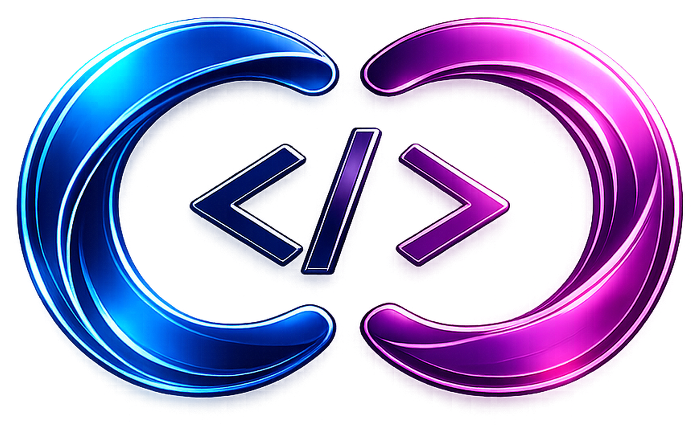

  

  # Coders Canvas

  ### *The Modular Developer Workspace & Snippet Command Center for VS Code*

  
  
  
  

  

    <b>Stop re-writing boilerplate. Organize, search, and instantly insert your favorite code snippets directly from your VS Code sidebar.</b>
  

---

## ✨ Overview

**Coders Canvas** is a high-performance, modular productivity extension designed to streamline your daily programming workflow. Engineered from the ground up with **React 18**, **TypeScript**, and **Google Font Bricolage Grotesque**, Coders Canvas gives you an interactive, visually stunning command center right inside your VS Code Activity Bar.

Whether you're juggling TypeScript boilerplates, React hooks, SQL queries, regex patterns, or Python scripts, **Coders Canvas** keeps your highest-value code right at your fingertips with zero context switching.

---

## 🚀 Key Features

### ⚡ Smart Snippet Command Center
* **Live Search**: Instant real-time filtering across titles, descriptions, code bodies, and tags.
* **Auto Language Detection**: Intelligently detects the language of your active editor and highlights matching snippets first.
* **Favorites & Pinning**: Star your go-to snippets to keep them pinned at the top of your library.
* **Tag System**: Group snippets by stack, framework, or utility (`#react`, `#frontend`, `#api`, `#sql`, `#docker`).

### 🎨 Language-Based Color Syntax Highlighting
* **Rich Syntax Highlighting**: Preview code with VS Code Dark+ color syntax tailored to each snippet’s language:
  * TypeScript & TSX
  * JavaScript & JSX
  * Python
  * HTML / XML
  * CSS / SCSS
  * JSON
  * SQL
  * Bash / Shell
  * Markdown
* **Interactive Tab-Stops**: Full support for native VS Code snippet placeholders (`$1`, `${1:variableName}`, `$0`) styled with subtle cursor indicators.

### 🪄 Save Selection from Editor in 1 Click
* Highlight any block of code in your active editor.
* Right-click and choose **`Coders Canvas: Save Selection as Snippet`**.
* The sidebar opens with your code, language, and suggested title automatically pre-filled!

### 🎯 Instant Insertion & Copy
* **Insert at Cursor**: Click **Insert** to inject snippet code right at your active editor cursor position, with instant tab-stop navigation between placeholders.
* **Copy to Clipboard**: Quick copy button with visual confirmation when you just need the code on your clipboard.

### 🔄 Universal Local Converters Hub (100% Offline & Private)
Stop uploading sensitive company files to sketchy converter sites! Convert files locally on your machine with zero lag and zero tracking:
* **Documents & Office**:
  * Word (`.docx`) ➔ **PDF**, **Markdown**, **HTML**, **Plain Text**
  * Markdown (`.md`) ➔ **PDF**, **HTML**, **Plain Text**
  * Plain Text (`.txt`) ➔ **PDF**
  * HTML (`.html`) ➔ **Markdown**, **PDF**
* **Images & Graphics**:
  * Cross-convert **PNG ↔ JPG ↔ WebP** with custom quality compression sliders
  * Generate **Favicon (`.ico`)** files from any image
  * Instant **Base64 Data URI** generation for CSS/HTML/React
* **Spreadsheets & Tables**:
  * Excel (`.xlsx`, `.xls`), `.csv`, `.tsv` ➔ **JSON Array**, **Markdown Table**, **HTML Table**, **CSV**
* **Data & Config (File & Live Scratchpad)**:
  * Two-way conversion between **JSON ↔ YAML ↔ XML ↔ .ENV**
* **VS Code Explorer Context Menu**:
  * Right-click any file in your project explorer ➔ **`Coders Canvas: Convert File...`** to convert and save beside the original in one click!

### 📦 Complete Workspace Portability (Backup & Restore)
* **Single-File Export**: Export your entire workspace collection into a clean `coders-canvas-workspace.json` file in one click.
* **Flexible Import**: Share snippet packs with teammates or restore backups with two convenient modes:
  * **Merge with Existing**: Appends new snippets while preserving your current collection.
  * **Replace All**: Replaces your workspace with the imported pack.

### 🔒 100% Offline, Private & Local
* Your code and documents are yours. **Coders Canvas has zero external telemetry, zero tracking, and makes no network requests.**
* All data and conversions run locally on your device in human-readable JSON (`workspace.json`).
* You can open and edit this raw data file anytime by clicking the **Folder** icon in the header or via the command palette.

### 🧩 Modular Architecture (Future-Ready)
* Coders Canvas is architected as an expandable modular developer hub:
  * ⚡ **Snippets Command Center** *(Active)*
  * 🔄 **Universal File Converters** *(Active)*
  * 💬 **AI Prompts Hub** *(Coming Soon)*
  * 📑 **Project Templates** *(Coming Soon)*
  * 📝 **Scratchpad & Notes** *(Coming Soon)*

---

## ⌨️ Command Palette Shortcuts

Press `Cmd + Shift + P` (Mac) or `Ctrl + Shift + P` (Windows/Linux) to access all commands:

| Command | Description |
| :--- | :--- |
| **`Coders Canvas: Convert File...`** | Converts any right-clicked file in the explorer to PDF, Markdown, WebP, etc. |
| **`Coders Canvas: Save Selection as Snippet`** | Creates a new snippet from your current editor selection |
| **`Coders Canvas: Insert Snippet`** | Inserts a selected snippet directly into your active document |
| **`Coders Canvas: Open Workspace Data File`** | Opens your local `workspace.json` data file on disk in VS Code |
| **`Coders Canvas: Export Workspace Data`** | Exports all workspace data to a standalone JSON file |
| **`Coders Canvas: Import Workspace Data`** | Imports workspace snippets from a JSON file (Merge or Replace) |
| **`Coders Canvas: Refresh View`** | Syncs the sidebar with disk storage |

---

## 💾 Where Your Data is Stored on Device

All snippets and workspace configurations are stored locally on your machine in a human-readable JSON file:

| Operating System | Default Storage Path |
| :--- | :--- |
| **macOS** | `~/Library/Application Support/Code/User/globalStorage/himanshuchuchra.coders-canvas/workspace.json` |
| **Windows** | `%APPDATA%\Code\User\globalStorage\himanshuchuchra.coders-canvas\workspace.json` |
| **Linux** | `~/.config/Code/User/globalStorage/himanshuchuchra.coders-canvas/workspace.json` |

> 💡 **Pro Tip**: Any manual edits you save to `workspace.json` in VS Code are instantly reloaded by the extension!

---

## 🛠️ Technology Stack

Coders Canvas is engineered with performance and aesthetics in mind:

- **Extension Host**: TypeScript + Node.js (VS Code Extension API)
- **Webview Architecture**: React 18 + TypeScript + Lucide Icons
- **Syntax Highlighting**: Prism.js syntax engine with language grammars
- **Typography**: Google Font *Bricolage Grotesque* & *JetBrains Mono*
- **Bundler**: `esbuild` dual-pipeline (Node CJS for host, Browser ESM for webview)

---

## 🤝 Contributing & Feedback

Have ideas, suggestions, or found a bug? We’d love to hear from you!

- **Report Issues & Feature Requests**: Reach out or file an issue on GitHub.
- **Enjoying Coders Canvas?**: Please consider leaving a ⭐ review on the [Visual Studio Marketplace](https://marketplace.visualstudio.com/items?itemName=himanshuchuchra.coders-canvas)!

---

  Crafted with care for developers who value speed, craft, and great tooling.

  **Coders Canvas** © 2026

